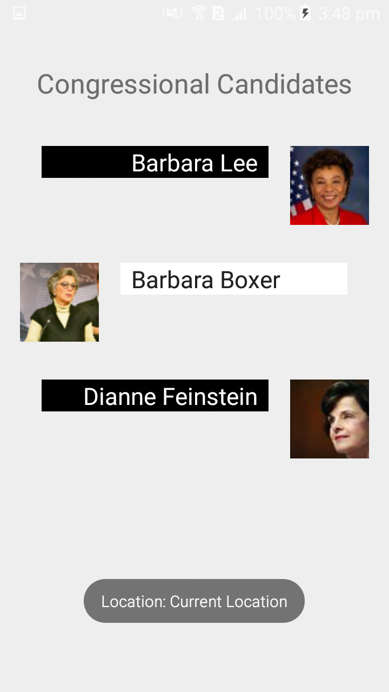
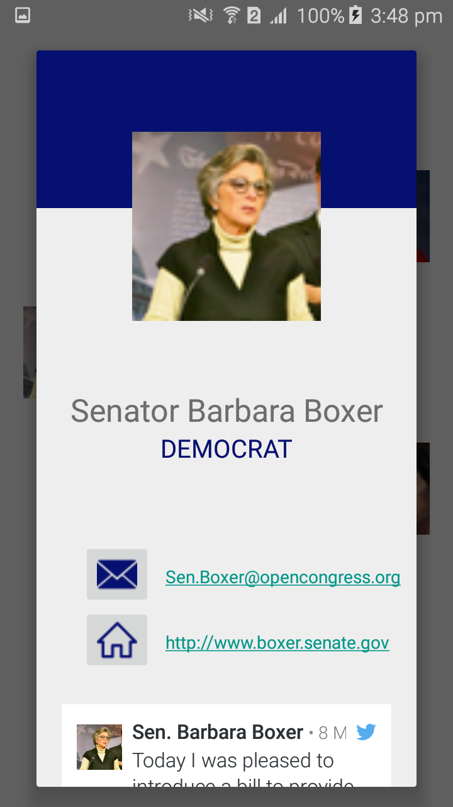

# PROG 02: Represent!

This app loads the congressional candidates for a particular location on both the smartphone and the paired smartwatch. The smartwatch interface provides us with a quick reference of the candidates and selecting one of them draws up a detailed view of that candidate on the smartphone. The smartwatch interface also allows access to 2012 voting data for that particular location. The smartphone interface allows us to view the name, party, email(hyperlinked), website(hyperlinked), bills sponsored, committees, latest tweet and picture of each candidate.

## Authors

Serah Isaac ([serah.isaactho@berkeley.edu](mailto:your_email@berkeley.edu))

## Demo Video

See Video Walkthrough (https://youtu.be/XJMW9CfrV_w)

## Screenshots

Mobile Screens

Wear Screens

